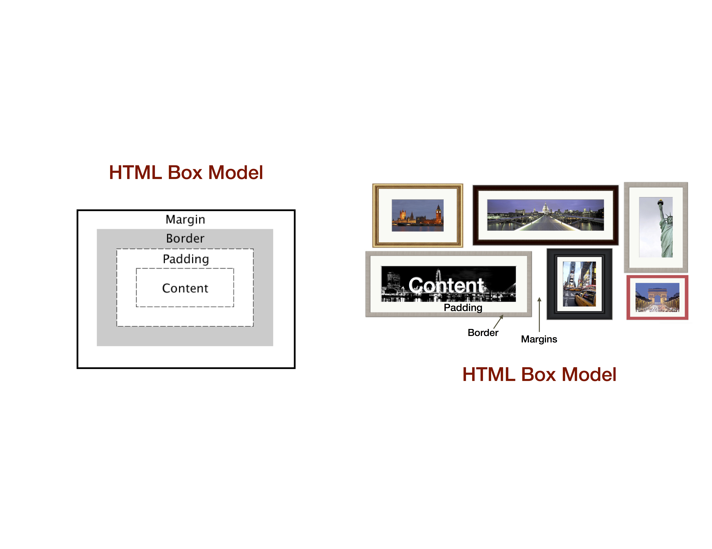

# Friendbook with Grid

In this project, we're going to switch from using a `<table>` for layout to a better system; a grid of `
`s that we'll `float` next to one another.

## Setup

 1. Click the "Clone or download" button.
 1. Select "Download ZIP".
 1. Extract and open the entire folder in Atom.
 1. Open `with_table.html` in Chrome.
 1. This was my solution to the homework. Study it and think up questions. CSS style rules are located in `our_styles.css`.
 1. Follow along with the video linked from Canvas
 1. We will explore some more CSS, the following diagram of the HTML Box Model will be useful:

 

## From table to grid

We translate the basic `<table>` layout to one that uses the `
` block element.  The `
` element is simply a way to contain or encapsulate some html within a block for some common styling purpose.

 1. Open up `with_grid.html`  
 1. Each `<table>` element has been translated to a `
` element as follows:

 table element | grid element
  ------------ | -------------
  `<table>`    |   `
`
  `<tr>`         |       `
`
  `<td class="main-content-cell" colspan="6”> `   |   `
`
